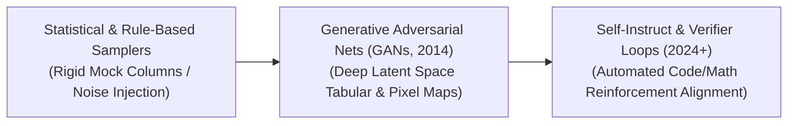

# Awesome-Synthetic-Data-Generation
## Synthetic Data Generation: Evolution, Variants, Types, & Applications

Synthetic Data Generation is the algorithmic curation of artificial data that mirrors the statistical properties, mathematical relationships, and structural configurations of real-world datasets. In modern artificial intelligence and data engineering, synthetic generation has evolved from basic rule-based tabular randomization to a primary pillar of frontier model training. As AI development encounters the "Data Wall"—the imminent exhaustion of high-quality, human-written internet text—synthetic data bridges the gap by producing massive, scalable, privacy-sovereign, and structurally flawless data matrices to train, align, and verify deep learning systems.

---

## 1. The Chronological Evolution

The technical progression of artificial data generation has transitioned from rigid heuristic samplers to generative deep learning distributions, moving toward structured self-correcting reasoning loops backed by digital verifiers.

*   **The Statistical & Heuristic Era (Traditional Data Mocking)**
    *   *Concept:* The structural baseline. Early frameworks relied on fixed mathematical rules, random noise injection, and parametric statistical distributions (e.g., Gaussian or Poisson processes) to generate synthetic rows. Databases used tools to output random names, sequential phone numbers, or mock financial transactions matching a set schema.
    *   *Limitation:* Lacked deep semantic context and complex cross-variable dependencies. The generated variables looked realistic in isolation but failed to capture the non-linear, hidden interactions present in real human systems.
*   **The Deep Generative & Adversarial Era (GAN / VAE / Diffusion, ~2014–2023)**
    *   *Concept:* Unlocked by deep learning. Models like **Generative Adversarial Networks (GANs)** and Variational Autoencoders (VAEs) learned to map continuous data distributions into compact, low-dimensional vector spaces. This era specialized in synthesizing highly realistic tabular records (e.g., fake medical charts) and high-fidelity pixel grids (e.g., generating realistic human faces or synthetic scene backgrounds via early Diffusion models).
    *   *Limitation:* Highly susceptible to mode collapse (repeating identical data rows) and unable to generate abstract multi-step reasoning steps or structured logical syntax natively.
*   **The Self-Correction & Verifier-Loop Era (~2024–Present)**
    *   *Concept:* The current modern state-of-the-art paradigm driving frontier models. It shifts away from unguided generative text dumps toward closed feedback loops using **Self-Instruct** and **Scalable Oversight** frameworks. Massive frontier models generate multi-step logical paths (reasoning traces, programming scripts, mathematical proofs), which are continuously checked by external, deterministic rules—such as sandboxed code compilers or interactive theorem provers (ITPs)—keeping only the provably correct examples.

---

## 2. Core Functional & Data-Type Variants

Synthetic Data Generation methodologies are strictly categorized based on the underlying data modality and the explicit target behavior of the curation pipeline.

*   **Tabular Synthetic Data**
    *   *Mechanism:* Replicates structural relational databases (e.g., banking logs, healthcare patient metrics). It models joint probability fields across columns, ensuring that the synthesized dataset retains identical correlation coefficients and statistical anomalies without containing real-world user identification.
*   **Textual Instruction & Reasoning Data (SFT/RL Cold Start)**
    *   *Mechanism:* Uses advanced frontier LLMs to synthesize thousands of distinct prompt-response scenarios. Variants like **Back-Translation** take structured, formal code and generate conversational human explanations for them, building large-scale, flawless parallel training corpuses.
*   **Visual & Spatio-Temporal Data (Simulation-to-Real)**
    *   *Mechanism:* Employs high-fidelity 3D rendering engines (such as Unreal Engine or NVIDIA Isaac Sim) paired with Diffusion Transformers (DiTs). It synthesizes photorealistic visual fields, continuous vehicle driving videos, or physical robotic kinetic interactions to train computer vision models.
*   **Privacy-Hardened Synthetic Data**
    *   *Mechanism:* Infuses mathematical **Differential Privacy (DP)** metrics during the generative training loop, adding controlled noise to guarantee that an adversary cannot reverse-engineer or re-identify a physical individual from the synthesized matrix.

---

## 3. High-Capacity Architectural & Generation Paradigms

To scale up data quality past standard text-dump thresholds, enterprise orchestration layers deploy specialized multi-step generation pipelines.

*   **Self-Instruct Frameworks (Prompt Expansion)**
    *   *Pipeline:* A bootstrapping technique. A model is seeded with a tiny pool of highly pristine, human-vetted instruction examples. The model recursively prompts itself to invent thousands of novel variations, alternative problem states, and edge-case tasks, expanding its own training pool exponentially.
*   **Process-Supervised Synthetics (PRM Generators)**
    *   *Pipeline:* Focuses on "thinking blocks." The generation engine does not just output a raw answer; it outputs a detailed, verbose multi-step reasoning trace. Each step is individually validated by a process-supervised reward model or a step-level verifier to weed out logical hallucinations early.
*   **LLM-as-a-Judge Curation Filters**
    *   *Pipeline:* Uses an ultra-large frontier model exclusively as a qualitative critic. A smaller model generates thousands of synthetic paragraphs, and the Judge model scores them against strict grading rubrics (e.g., logical clarity, structural formatting, fact-checking boundaries), instantly purging low-quality rows.

---

## 4. Production Engineering Challenges & Mitigations

Deploying synthetic data generation loops at industrial scales introduces critical semantic drift vulnerabilities and computational barriers.

*   **The Model Collapse and Semantic Drift Threat**
    *   *The Problem:* If a model is trained recursively on unverified synthetic data generated by its predecessors (e.g., Model $N$ trained on data from Model $N-1$), the underlying statistical distribution degrades over generations. The model amplifies early minor errors, resulting in **Model Collapse**—where the network outputs repetitive gibberish or experiences a severe drop in data diversity.
    *   *Mitigation:* Implementing a **"Less is More" strict verification paradigm**, injecting real-world anchor datasets at fixed intervals, and using automated programmatic filters (like code compilers or compilers) to guarantee absolute data validity before fine-tuning.
*   **The High Token Cost and Infrastructure Overhead**
    *   *The Problem:* Generating millions of high-quality, long-form multi-step reasoning traces using cloud APIs consumes massive token budgets and generates intense server processing latency, slowing down MLOps scaling cycles.
    *   *Mitigation:* Deploying highly optimized **Inference Serving Engines (vLLM / Speculative Decoding)** running compact, distilled open-weights models specifically fine-tuned for high-speed, structural synthetic text production.

---

## 5. Frontier Real-World AI Applications

*   **Pre-Training & Post-Training Alignment of Frontier LLMs**
    *   *Application:* Serves as the critical baseline infrastructure enabling models to break past human data scarcity barriers. Advanced reasoning models are fine-tuned using millions of synthetically generated mathematical proofs, Python execution paths, and self-correction code traces to build System 2 cognitive processing capabilities natively.
*   **Sim-to-Real Perception Training for Autonomous Vehicle Fleets**
    *   *Application:* Generates rare, safety-critical driving scenarios that are practically impossible to collect safely in the physical world (e.g., a child running out from behind a parked truck during a blinding snowstorm at midnight). High-fidelity video synthesis and 3D physics simulators generate thousands of these edge cases to train autonomous vehicle vision arrays robustly.
*   **Privacy-Compliant Medical Diagnostic Research**
    *   *Application:* Synthesizes patient health databases, genomic sequencing arrays, and electronic health records (EHR). Synthetic generation engines output realistic clinical charts that preserve exact disease-symptom correlation metrics perfectly, letting cross-institutional researchers train diagnostic networks without violating strict patient privacy laws like HIPAA or GDPR.

