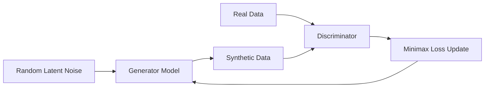

# The Deep Generative & Adversarial Era (GAN / VAE / Diffusion)

This era represents a paradigm shift where deep neural networks learn the latent structure of high-dimensional distributions (images, tables, sequential logs) to sample realistic instances.

## Core Technologies
1. **Generative Adversarial Networks (GANs):** A generator and discriminator play a minimax game to produce photorealistic images or tabular records.
2. **Variational Autoencoders (VAEs):** Encode input data into a continuous latent space and decode samples.
3. **Diffusion Models:** Reverse a progressive noise-addition process to generate high-fidelity media.

## Architecture Diagram

[Back to Main README](../README.md)
