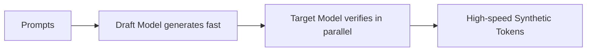

# The High Token Cost and Infrastructure Overhead

Generating millions of tokens of multi-step reasoning traces or simulation fields incurs high infrastructure costs and serving latency.

## Optimizations
1. **Speculative Decoding:** Running a small draft model to generate tokens, verified in parallel by a larger target model.
2. **Serving Optimization (e.g., vLLM):** Implementing PagedAttention to maximize throughput.
3. **Model Distillation:** Distilling the capabilities of huge models into highly optimized, smaller local generators.

## Serving Pipeline

[Back to Main README](../README.md)
