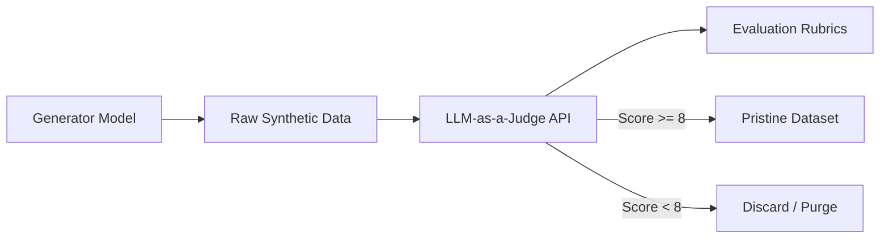

# LLM-as-a-Judge Curation Filters

Utilizing highly capable frontier models (like GPT-4 or Claude) to critique, score, and filter synthetic data outputs generated by smaller, faster models.

## Implementation Details
1. **Rubric-Based Evaluation:** Providing explicit, structured criteria for scoring (e.g., helpfulness, safety, truthfulness).
2. **Pairwise Comparison:** Showing the judge two responses to choose the superior option.
3. **Deduplication and Quality Gates:** Automatically dropping any sample scoring below a predefined threshold.

## Workflow Diagram

[Back to Main README](../README.md)
