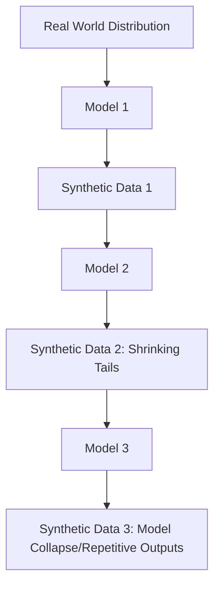

# The Model Collapse and Semantic Drift Threat

A fundamental risk in synthetic data workflows: if models are recursively trained on data generated by earlier models, statistical errors propagate and compound, leading to catastrophic collapse.

## Causes
1. **Statistical Approximation Errors:** Generative models focus on high-probability areas, ignoring tail distributions.
2. **Error Accumulation:** Early errors become ground truth for subsequent models.
3. **Loss of Diversity:** Output distributions converge to repetitive patterns.

## Collapse Cycle Diagram

[Back to Main README](../README.md)
