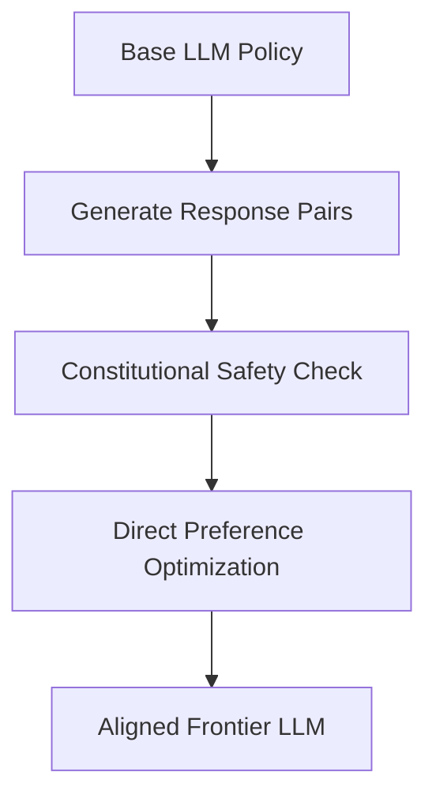

# Pre-Training & Post-Training Alignment of Frontier LLMs

How synthetic data acts as the fuel for pre-training models (overcoming the data wall) and aligns models during post-training (SFT, DPO, RLHF).

## Integration
1. **Mathematical & Code Pre-training:** Utilizing synthetically generated formal proofs and executed code traces.
2. **Constitutional AI:** Aligning LLMs with safety/helpfulness guidelines using self-critique and feedback loops.
3. **Preference Pair Curation:** Generating contrastive prompt-response pairs for preference optimization algorithms.

## Alignment Loop Diagram

[Back to Main README](../README.md)
