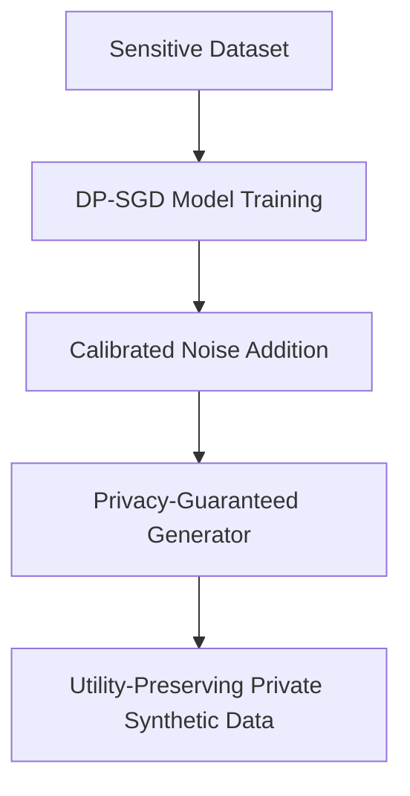

# Privacy-Hardened Synthetic Data

Ensuring synthetic data does not leak confidential information from the original dataset by incorporating formal mathematical privacy guarantees such as Differential Privacy (DP).

## Principles
1. **Differential Privacy (DP):** Adding mathematically calibrated noise during model training (e.g., DP-SGD) or query execution.
2. **Membership Inference Defense:** Preventing adversaries from determining if a specific individual was part of the training set.
3. **Utility-Privacy Tradeoff:** Finding the optimal balance between statistical accuracy and privacy preservation.

## Concept Diagram

[Back to Main README](../README.md)
