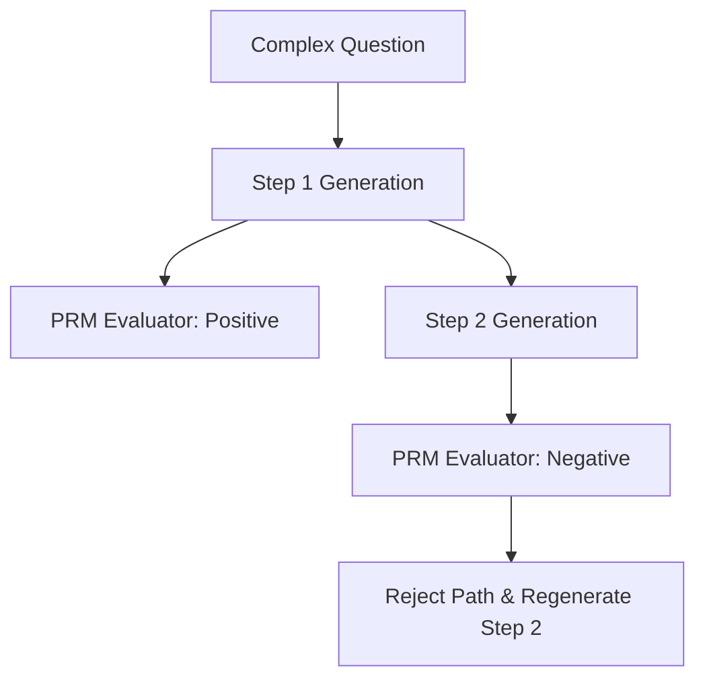

# Process-Supervised Synthetics (PRM Generators)

Training and scaling models by supervising the individual steps of reasoning (process-based supervision) instead of just checking the final answer (outcome-based supervision).

## Key Advantages
1. **Hallucination Detection:** Pinpoints exactly which step went wrong.
2. **Reinforcement Alignment:** Provides step-level feedback signals for reinforcement learning.
3. **Dense Reward Signals:** Offers richer feedback compared to sparse final outcomes.

## Generation Diagram

[Back to Main README](../README.md)
