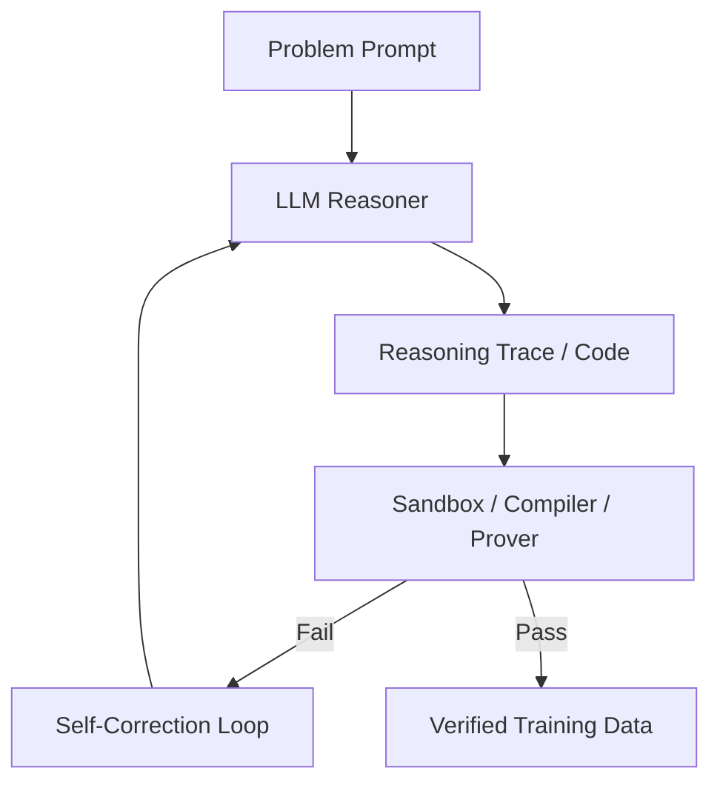

# The Self-Correction & Verifier-Loop Era

The modern era of synthetic data focuses on generating reasoning traces, code, and mathematics using closed-loop validation pipelines that filter outputs via deterministic verifiers.

## Core Workflow
1. **Drafting Reasoning:** Language models generate multi-step explanations or program solutions.
2. **Deterministic Verification:** Code is run in sandboxes; math is checked using interactive theorem provers or unit tests.
3. **Bootstrapping / Fine-Tuning:** The model is recursively fine-tuned only on samples that pass verification.

## Workflow Diagram

[Back to Main README](../README.md)
