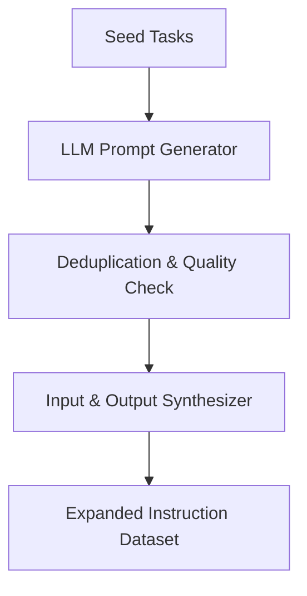

# Self-Instruct Frameworks (Prompt Expansion)

A bootstrapping methodology where an LLM recursively expands a small seed set of tasks into a massive dataset of instructions and inputs.

## Pipeline Steps
1. **Prompt Generation:** Generating new tasks based on seed examples.
2. **Classification:** Deciding whether the generated task is classification or generation.
3. **Input/Output Generation:** Creating test cases and answers for the new tasks.
4. **Filtering:** Purging low-quality or highly repetitive instructions.

## Pipeline Diagram

[Back to Main README](../README.md)
