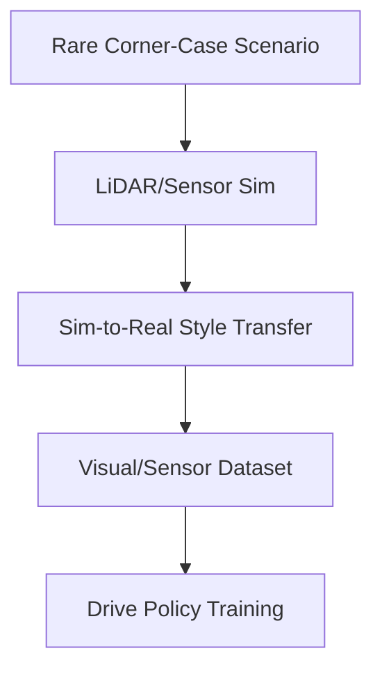

# Sim-to-Real Perception Training for Autonomous Vehicle Fleets

Autonomous vehicle fleets require millions of miles of corner-case driving scenarios (e.g., rare accidents, extreme weather) that are unsafe or impossible to capture in the real world.

## Curation Steps
1. **3D Virtual Scenario Placement:** Placing obstacles, pedestrians, and dynamic actors in virtual environments.
2. **Sensor Simulation:** Synthesizing exact radar, LiDAR, and camera feeds matching autonomous vehicle configurations.
3. **Sim-to-Real Transfer:** Utilizing techniques like style transfer and domain randomization to bridge the fidelity gap.

## Architecture Diagram

[Back to Main README](../README.md)
