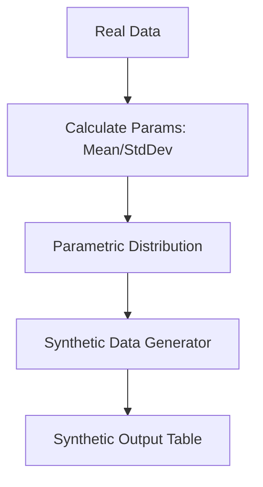

# The Statistical & Heuristic Era (Traditional Data Mocking)

The Statistical & Heuristic Era forms the foundation of synthetic data generation. It relies on fixed mathematical rules, random noise injection, and parametric statistical distributions to generate synthetic data.

## Core Mechanics
1. **Rule-Based Mocking:** Defining static formats (e.g., regex patterns for emails or phone numbers).
2. **Parametric Sampling:** Fitting probability distributions (e.g., Gaussian, Poisson) to original data and sampling new points.
3. **Noise Injection:** Adding perturbation to existing data to preserve privacy while maintaining basic statistics.

## Concept Diagram

[Back to Main README](../README.md)
