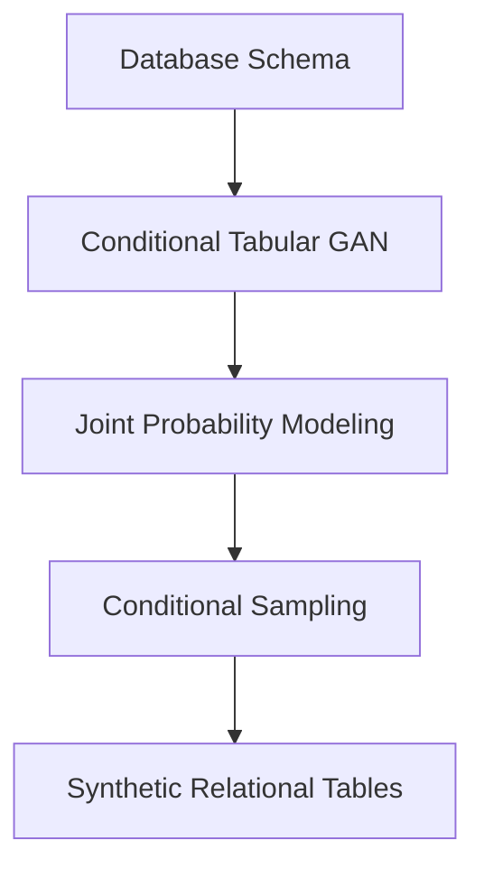

# Tabular Synthetic Data

Tabular synthetic data replication focuses on modeling structural relational databases (like transaction databases or EHRs) while maintaining joint probabilities and correlations between columns.

## Key Methods
1. **Marginal Distribution Modeling:** Capturing individual column characteristics.
2. **Copulas and Bayesian Networks:** Modeling the dependency structure across different attributes.
3. **Conditional GANs (e.g., CTGAN):** Handling mixed-type data and imbalanced columns.

## Generation Diagram

[Back to Main README](../README.md)
