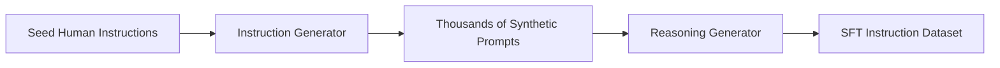

# Textual Instruction & Reasoning Data (SFT/RL Cold Start)

Generating synthetic textual instructions, reasoning pathways, and conversational datasets to bootstrap frontier LLMs without relying on scarce human-generated web data.

## Strategic Techniques
1. **Seed Task Scaling:** Using a few human examples to generate thousands of instruction variants.
2. **Back-Translation:** Taking formal code or data and prompting LLMs to write the natural language prompt that would produce it.
3. **Chain-of-Thought Synthesis:** Generating explicit step-by-step reasoning steps.

## Pipeline Diagram

[Back to Main README](../README.md)
