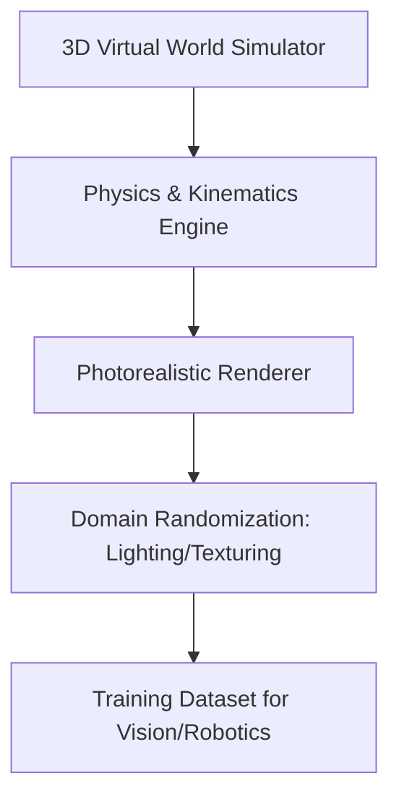

# Visual & Spatio-Temporal Data (Simulation-to-Real)

Using game engines, physical simulators, and generative video architectures to construct high-fidelity datasets for computer vision, robotics, and spatial intelligence.

## Methodologies
1. **Physics-Engine Simulations:** Replicating real-world kinematics in environments like Unreal Engine or Isaac Sim.
2. **Domain Randomization:** Randomly altering colors, lighting, and textures to prevent overfitting to simulated environments.
3. **Video Generative Models:** Synthesizing continuous video frames depicting physical motion.

## Pipeline Diagram

[Back to Main README](../README.md)
